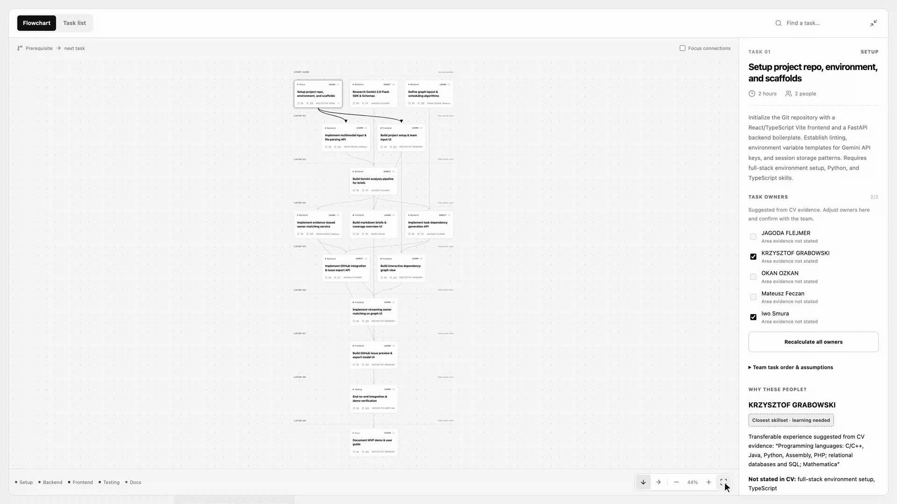
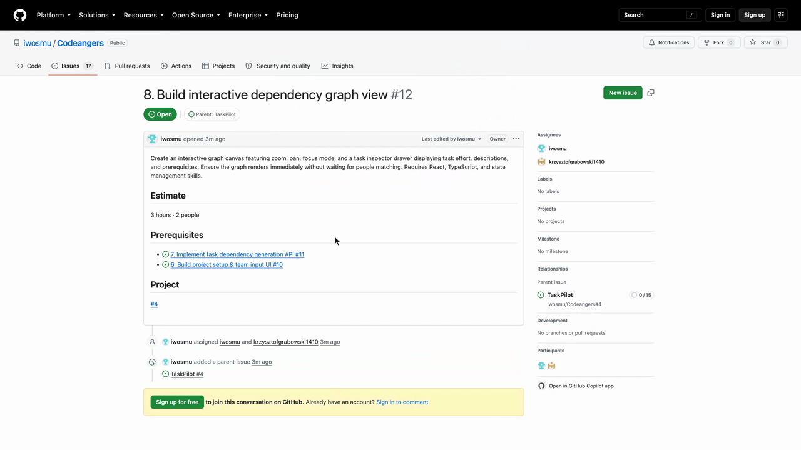
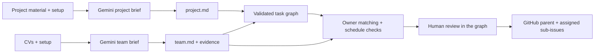

# TaskPilot

### From project brief to clear ownership.

TaskPilot helps a newly formed team answer **what are we building, who can help, and what needs to happen first?** Give it a project brief and the team's CVs; it produces shared Markdown briefs, a dependency graph, evidence-backed owner suggestions, and a reviewed GitHub issue export.

Built by **Codeangers** at the **Google Student AI Hackathon in Warsaw · 15 September 2026**. This repository is now a record of the completed hackathon prototype and the work behind it.

**[Watch the demo · 2:45](https://www.youtube.com/watch?v=rPXVT3FQx7k)** · **[Pitch deck · PDF](docs/submission/TaskPilot-presentation.pdf)** · [Canva presentation](https://canva.link/288wybtg4tkh9az) · [Live app](https://codeangers-web.onrender.com/) · [Submission snapshot](https://github.com/iwosmu/Codeangers/tree/iwosmu/hackathon-submission-2026-09-15)

[](https://www.youtube.com/watch?v=rPXVT3FQx7k)

*The working graph view from the demo. The chart loads first; people matching follows on the same page.*

## Why we built it

The first hours of a project often disappear into coordination. The idea exists in slightly different versions in everyone's head, nobody has read everyone else's CV, and deciding who should do what becomes guesswork.

Our starting user was a student meeting a hackathon team for the first time and trying to get building that evening. The same kickoff problem could apply to university projects, student organisations, or corporate innovation days. Those broader uses were pitch directions, not validated customer outcomes.

The idea was simple: **AI recommends. Your team decides.**

## What the prototype does

1. **Understand the project.** Accept a description, constraints, and optional material such as a Markdown PRD, PDF, slides, whiteboard photo, or audio note. Produce `project.md` with deliverables, context, success criteria, and open questions.
2. **Understand the team.** Accept mixed-format CVs or pasted text for **2–8 people**. Produce `team.md`, individual profiles, and a coverage map with references to CV evidence. Missing information stays “not stated.”
3. **Build the task flow.** Generate tasks and their prerequisites, then validate the dependency graph. Zoom, pan, change orientation, and inspect the work that can proceed in parallel.
4. **Suggest owners in the graph.** Show direct matches, related experience that needs learning, and unconfirmed fit. When expertise is missing, expose the gap and suggest a contributor with relevant transferable evidence and a first learning step. People can review and edit assignments.
5. **Put the reviewed plan into GitHub.** Confirm teammate accounts and a repository, preview the issues, then create one parent issue with assigned sub-issues and prerequisite links.

[](https://github.com/iwosmu/Codeangers/issues/12)

**The demo used TaskPilot itself as a new project, plus our five-person team's CVs.** It produced [parent issue #4](https://github.com/iwosmu/Codeangers/issues/4) and 15 assigned sub-issues. These issues are historical demo output, not a current implementation backlog.

## Submission and project history

| Material | Where to find it |
| --- | --- |
| Final demo, including GitHub results | [YouTube · 2:45](https://www.youtube.com/watch?v=rPXVT3FQx7k) · [Exact 4K MP4](https://github.com/iwosmu/Codeangers/raw/refs/heads/iwosmu/hackathon-submission-2026-09-15/docs/submission/TaskPilot-demo-4K-smooth.mp4) |
| Submitted six-slide presentation | [Original PDF](docs/submission/TaskPilot-presentation.pdf) · [Canva](https://canva.link/288wybtg4tkh9az) |
| Original two-minute demo backup | [Exact 4K MP4](https://github.com/iwosmu/Codeangers/raw/refs/heads/iwosmu/hackathon-submission-2026-09-15/docs/submission/TaskPilot-demo-4K-original.mp4) |
| Frozen submission source and assets | [`iwosmu/hackathon-submission-2026-09-15`](https://github.com/iwosmu/Codeangers/tree/iwosmu/hackathon-submission-2026-09-15) |
| Source commit used for the demo | [`66c0daf`](https://github.com/iwosmu/Codeangers/tree/66c0dafa0361e98ca7d2f381abbf07104efd3e3a) |
| Original demo project brief | [PRD](demo/project-prd.md) |
| Artifact provenance and checksums | [Submission archive](docs/submission/README.md) |
| Frozen GitHub export | [16-issue JSON snapshot](docs/submission/github-issues.json) |

The submission branch preserves the application and original root README before this retrospective. The PDF and both videos are unchanged copies, with SHA-256 checksums. The final demo uses real Gemini results replayed from memory with shortened waits; it is a product walkthrough, not a latency benchmark. The live Render deployment may sleep or become unavailable, so the video and archived assets are the lasting reference.

## How it works



- **Frontend:** React, TypeScript, Vite, and a custom SVG graph interface.
- **Backend:** FastAPI and Pydantic, with Gemini through `google-genai`.
- **Generation:** separate project and team calls, structured JSON validation, Markdown rendering in code, followed by graph and assignment stages.
- **Multimodal input:** Gemini handles PDF, image, and audio content; DOCX/PPTX handling extracts text and raster images. Large assets use the Gemini Files API with cleanup.
- **State:** application inputs and generated results live in request/browser-session memory. GitHub is an explicit export destination.

See [development and architecture notes](docs/DEVELOPMENT.md), [API documentation](api/README.md), and the [recording workflow](demo/README.md).

## Retrospective

We did not win the hackathon. We did build an end-to-end prototype that connected multimodal intake, shared briefs, dependency planning, skill matching, and a real GitHub export in one workflow.

**What was worth keeping:** evidence references made suggestions inspectable; independent generation stages made iteration easier; putting owner matching directly into the graph kept the plan and the people together; a real issue export gave the demo a concrete endpoint.

**What needs more work:** CVs are incomplete descriptions of people, and semantic skill matching can still be wrong. “Closest skillset” is a reviewable suggestion, not a measured prediction of learning speed. Time estimates assume availability and omit learning time. The prototype has no persistent shared workspace, and the pitch's faster-kickoff claims were not measured in a user study.

If revisited, the next useful work would be a small kickoff study with real teams, explicit availability and preferred-role inputs, stronger evaluation of adjacent-skill matches, and better handling of project changes after the first plan.

## Team Codeangers

[Jagoda Flejmer](https://github.com/jFlamer) · [Krzysztof Grabowski](https://github.com/krzysztofgrabowski1410) · [Okan Ozkan](https://github.com/the0kan) · [Mateusz Feczan](https://github.com/MattNattFeczan) · [Iwo Smura](https://github.com/iwosmu)

## Run locally

Requires Python 3.12+, `uv`, Node.js, npm, and a Gemini API key. From the repository root:

```sh
cp .env.example .env.local
# Set GEMINI_API_KEY in .env.local. Never commit that file.
cd api
uv sync --locked
uv run uvicorn app.main:app --reload --port 8000
```

In another terminal:

```sh
cd web
npm ci
npm run dev
```

Open `http://localhost:5173`. The configured hackathon model is `gemini-3.8-flash`; `GEMINI_MODEL` can be changed in `.env.local` to a model available to your account. Current model availability and hosting are not guaranteed by this archive.

Raw CVs, credentials, and private team conversations are not part of the repository.
